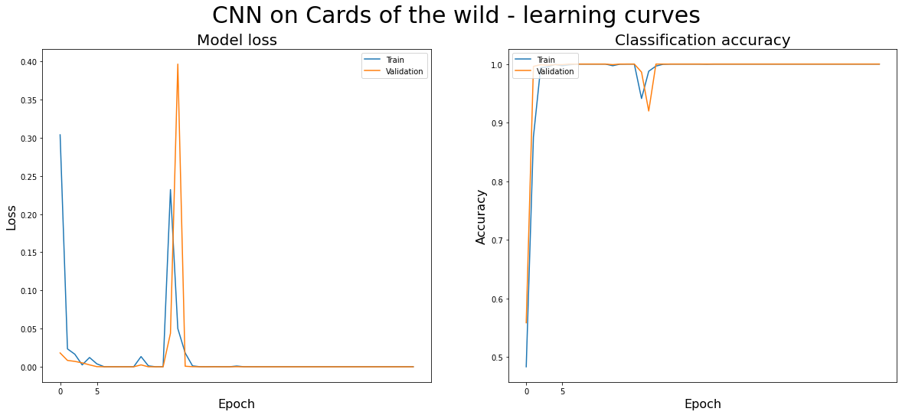

# CNN example

The goal of this example is to show you how to:


*   Access your Google Drive space from Google Colab
*   Access the folders and files you have there from Python
*   Use Keras *ImageDataGenerator* to train with large image datasets that do not fit in memory all at once
*   Define a CNN and train it using the *ImageDataGenerator*

## Step 1. Mount your Google Drive

Mounting a drive or folder is the Unix-like slang equivalent to connecting a drive or folder. Once you have mounted a drive, it will be available for the whole session.

It can be done directly from Python, as shown below, and for security reasons it will ask you to check your Google account and paste the validation token provided before you can access your data.

The specific location of the dataset depends on the organization of your Drive unit (maybe yours is under Shared/).


```python
from google.colab import drive
drive.mount('/content/drive')
```

    Drive already mounted at /content/drive; to attempt to forcibly remount, call drive.mount("/content/drive", force_remount=True).
    

Now under /content/drive/MyDrive/Data/Cards/ (or wherever you have it on your Drive) you can access the files.
The Cards dataset is structured in three folders: train, validation and test.
Each folder is further split in three subfolders, one for each character class.

### Quick check

We will use ```glob``` (Python function similar to ```dir``` or ```ls```, to get the contents of a folder) to check that the data is available. You should see all three folders (train, validation, test) as output.


```python
import glob
path = '/content/drive/MyDrive/dades/Cards/'
glob.glob(path + '*')
```


    ['/content/drive/MyDrive/dades/Cards/validation',
     '/content/drive/MyDrive/dades/Cards/test',
     '/content/drive/MyDrive/dades/Cards/train']


## Step 2. Create the ImageDataGenerator

Very often, image datasets are very large and they cannot be fully loaded into memory at once. Therefore an alternate strategy is needed, where at any given time only the images being used are actually loaded into memory. 

This can be done manually, but as it is a very frequent situation, Keras already includes a class that does the job: ```ImageDataGenerator```. 

It lets you create image file iterators with which you can load the images dynamically. You would usually create one iterator for each subset (train, validation, test).

Moreover, you have to specify the batch size, as it will load as many images as the batch size every time it is invoked by the neural network training loop.


```python
!pip install tensorflow==2.2
```

    Requirement already satisfied: tensorflow==2.2 in /usr/local/lib/python3.6/dist-packages (2.2.0)
    Requirement already satisfied: tensorflow-estimator<2.3.0,>=2.2.0 in /usr/local/lib/python3.6/dist-packages (from tensorflow==2.2) (2.2.0)
    Requirement already satisfied: absl-py>=0.7.0 in /usr/local/lib/python3.6/dist-packages (from tensorflow==2.2) (0.10.0)
    Requirement already satisfied: wrapt>=1.11.1 in /usr/local/lib/python3.6/dist-packages (from tensorflow==2.2) (1.12.1)
    Requirement already satisfied: six>=1.12.0 in /usr/local/lib/python3.6/dist-packages (from tensorflow==2.2) (1.15.0)
    Requirement already satisfied: tensorboard<2.3.0,>=2.2.0 in /usr/local/lib/python3.6/dist-packages (from tensorflow==2.2) (2.2.2)
    Requirement already satisfied: google-pasta>=0.1.8 in /usr/local/lib/python3.6/dist-packages (from tensorflow==2.2) (0.2.0)
    Requirement already satisfied: keras-preprocessing>=1.1.0 in /usr/local/lib/python3.6/dist-packages (from tensorflow==2.2) (1.1.2)
    Requirement already satisfied: h5py<2.11.0,>=2.10.0 in /usr/local/lib/python3.6/dist-packages (from tensorflow==2.2) (2.10.0)
    Requirement already satisfied: wheel>=0.26; python_version >= "3" in /usr/local/lib/python3.6/dist-packages (from tensorflow==2.2) (0.36.2)
    Requirement already satisfied: scipy==1.4.1; python_version >= "3" in /usr/local/lib/python3.6/dist-packages (from tensorflow==2.2) (1.4.1)
    Requirement already satisfied: protobuf>=3.8.0 in /usr/local/lib/python3.6/dist-packages (from tensorflow==2.2) (3.12.4)
    Requirement already satisfied: grpcio>=1.8.6 in /usr/local/lib/python3.6/dist-packages (from tensorflow==2.2) (1.32.0)
    Requirement already satisfied: numpy<2.0,>=1.16.0 in /usr/local/lib/python3.6/dist-packages (from tensorflow==2.2) (1.19.4)
    Requirement already satisfied: astunparse==1.6.3 in /usr/local/lib/python3.6/dist-packages (from tensorflow==2.2) (1.6.3)
    Requirement already satisfied: opt-einsum>=2.3.2 in /usr/local/lib/python3.6/dist-packages (from tensorflow==2.2) (3.3.0)
    Requirement already satisfied: termcolor>=1.1.0 in /usr/local/lib/python3.6/dist-packages (from tensorflow==2.2) (1.1.0)
    Requirement already satisfied: gast==0.3.3 in /usr/local/lib/python3.6/dist-packages (from tensorflow==2.2) (0.3.3)
    Requirement already satisfied: requests<3,>=2.21.0 in /usr/local/lib/python3.6/dist-packages (from tensorboard<2.3.0,>=2.2.0->tensorflow==2.2) (2.23.0)
    Requirement already satisfied: setuptools>=41.0.0 in /usr/local/lib/python3.6/dist-packages (from tensorboard<2.3.0,>=2.2.0->tensorflow==2.2) (50.3.2)
    Requirement already satisfied: werkzeug>=0.11.15 in /usr/local/lib/python3.6/dist-packages (from tensorboard<2.3.0,>=2.2.0->tensorflow==2.2) (1.0.1)
    Requirement already satisfied: google-auth<2,>=1.6.3 in /usr/local/lib/python3.6/dist-packages (from tensorboard<2.3.0,>=2.2.0->tensorflow==2.2) (1.17.2)
    Requirement already satisfied: markdown>=2.6.8 in /usr/local/lib/python3.6/dist-packages (from tensorboard<2.3.0,>=2.2.0->tensorflow==2.2) (3.3.3)
    Requirement already satisfied: tensorboard-plugin-wit>=1.6.0 in /usr/local/lib/python3.6/dist-packages (from tensorboard<2.3.0,>=2.2.0->tensorflow==2.2) (1.7.0)
    Requirement already satisfied: google-auth-oauthlib<0.5,>=0.4.1 in /usr/local/lib/python3.6/dist-packages (from tensorboard<2.3.0,>=2.2.0->tensorflow==2.2) (0.4.2)
    Requirement already satisfied: idna<3,>=2.5 in /usr/local/lib/python3.6/dist-packages (from requests<3,>=2.21.0->tensorboard<2.3.0,>=2.2.0->tensorflow==2.2) (2.10)
    Requirement already satisfied: urllib3!=1.25.0,!=1.25.1,<1.26,>=1.21.1 in /usr/local/lib/python3.6/dist-packages (from requests<3,>=2.21.0->tensorboard<2.3.0,>=2.2.0->tensorflow==2.2) (1.24.3)
    Requirement already satisfied: chardet<4,>=3.0.2 in /usr/local/lib/python3.6/dist-packages (from requests<3,>=2.21.0->tensorboard<2.3.0,>=2.2.0->tensorflow==2.2) (3.0.4)
    Requirement already satisfied: certifi>=2017.4.17 in /usr/local/lib/python3.6/dist-packages (from requests<3,>=2.21.0->tensorboard<2.3.0,>=2.2.0->tensorflow==2.2) (2020.12.5)
    Requirement already satisfied: pyasn1-modules>=0.2.1 in /usr/local/lib/python3.6/dist-packages (from google-auth<2,>=1.6.3->tensorboard<2.3.0,>=2.2.0->tensorflow==2.2) (0.2.8)
    Requirement already satisfied: cachetools<5.0,>=2.0.0 in /usr/local/lib/python3.6/dist-packages (from google-auth<2,>=1.6.3->tensorboard<2.3.0,>=2.2.0->tensorflow==2.2) (4.2.0)
    Requirement already satisfied: rsa<5,>=3.1.4; python_version >= "3" in /usr/local/lib/python3.6/dist-packages (from google-auth<2,>=1.6.3->tensorboard<2.3.0,>=2.2.0->tensorflow==2.2) (4.6)
    Requirement already satisfied: importlib-metadata; python_version < "3.8" in /usr/local/lib/python3.6/dist-packages (from markdown>=2.6.8->tensorboard<2.3.0,>=2.2.0->tensorflow==2.2) (3.3.0)
    Requirement already satisfied: requests-oauthlib>=0.7.0 in /usr/local/lib/python3.6/dist-packages (from google-auth-oauthlib<0.5,>=0.4.1->tensorboard<2.3.0,>=2.2.0->tensorflow==2.2) (1.3.0)
    Requirement already satisfied: pyasn1<0.5.0,>=0.4.6 in /usr/local/lib/python3.6/dist-packages (from pyasn1-modules>=0.2.1->google-auth<2,>=1.6.3->tensorboard<2.3.0,>=2.2.0->tensorflow==2.2) (0.4.8)
    Requirement already satisfied: zipp>=0.5 in /usr/local/lib/python3.6/dist-packages (from importlib-metadata; python_version < "3.8"->markdown>=2.6.8->tensorboard<2.3.0,>=2.2.0->tensorflow==2.2) (3.4.0)
    Requirement already satisfied: typing-extensions>=3.6.4; python_version < "3.8" in /usr/local/lib/python3.6/dist-packages (from importlib-metadata; python_version < "3.8"->markdown>=2.6.8->tensorboard<2.3.0,>=2.2.0->tensorflow==2.2) (3.7.4.3)
    Requirement already satisfied: oauthlib>=3.0.0 in /usr/local/lib/python3.6/dist-packages (from requests-oauthlib>=0.7.0->google-auth-oauthlib<0.5,>=0.4.1->tensorboard<2.3.0,>=2.2.0->tensorflow==2.2) (3.1.0)
    


```python
import tensorflow as tf
```


```python
img_gen    = tf.keras.preprocessing.image.ImageDataGenerator()

train_iter = img_gen.flow_from_directory(path + 'train/', class_mode='categorical', batch_size=64)

valid_iter = img_gen.flow_from_directory(path + 'validation/', class_mode='categorical', batch_size=64)

test_iter  = img_gen.flow_from_directory(path + 'test/', class_mode='categorical', batch_size=64)

```

    Found 20000 images belonging to 3 classes.
    Found 4141 images belonging to 3 classes.
    Found 2000 images belonging to 3 classes.
    

We can easily check that the iterators are working properly by retrieving one batch and checking the shape of the data retrieved.


```python
batch_x, batch_y = train_iter.next() 
print(batch_x.shape, batch_y.shape)
```

    (64, 256, 256, 3) (64, 3)
    

## Step 3. Create and train the CNN

The only difference from a standard CNN example is that we have to specify the iterators for training, validation and testing.

We can get the shape of the input to our neural network (pixels x pixels x channels) by checking the shape of the batch just retrieved and removing the first component (which is the number of images in the batch).

In the same way, the number of classes can be inferred from the number of columns of the ```y``` matrix (remember that it has been one-hot encoded, so there is one column per class).

As for the structure of the CNN itself, the example here has two conv+conv+maxpool blocks followed by two dense layers to adapt the convolutional filters to a suitable output.

**TO DO**: experiment with different network structures (number of layers, filters, etc.). Evaluate the performance and keep the best model to use it in your game/app.

**Hint**: as the resolution of the images is relatively high (at least for a CNN), a pooling layer is added after each convolutional layer.


```python
from tensorflow.keras.models import Sequential
from tensorflow.keras.layers import Dense, Dropout, Flatten
from tensorflow.keras.layers import Conv2D, MaxPooling2D

input_shape = batch_x.shape[1:]
num_classes = batch_y.shape[1]


mycnn = Sequential()
mycnn.add(Conv2D(32, kernel_size=(5, 5), padding='valid',
                 activation='relu', 
                 input_shape=input_shape, name='Conv1'))
mycnn.add(MaxPooling2D(pool_size=(4, 4)))

mycnn.add(Conv2D(64, (3, 3), padding='valid', activation='relu', name='Conv2'))
mycnn.add(MaxPooling2D(pool_size=(2, 2)))

#mycnn.add(Dropout(0.25, name='Dropout1'))

mycnn.add(Conv2D(32, kernel_size=(3, 3), padding='valid',
                 activation='relu', 
                 input_shape=input_shape, name='Conv3'))
mycnn.add(MaxPooling2D(pool_size=(2, 2)))

mycnn.add(Conv2D(32, (3, 3), padding='valid', activation='relu', name='Conv4'))
mycnn.add(MaxPooling2D(pool_size=(2, 2)))

#mycnn.add(Dropout(0.25, name='Dropout2'))


mycnn.add(Flatten(name='Flatten1'))
mycnn.add(Dense(512, activation='relu', name='Dense1'))
mycnn.add(Dense(128, activation='relu', name='Dense2'))
mycnn.add(Dense(32,  activation='relu', name='Dense3'))

#mycnn.add(Dropout(0.25, name='Dropout3'))
mycnn.add(Dense(num_classes, activation='softmax', name='Dense2-output'))

mycnn.compile(loss='categorical_crossentropy', optimizer='adam', metrics=['accuracy'])
```


```python
mycnn.summary()
```

    Model: "sequential"
    _________________________________________________________________
    Layer (type)                 Output Shape              Param #   
    =================================================================
    Conv1 (Conv2D)               (None, 252, 252, 32)      2432      
    _________________________________________________________________
    max_pooling2d (MaxPooling2D) (None, 63, 63, 32)        0         
    _________________________________________________________________
    Conv2 (Conv2D)               (None, 61, 61, 64)        18496     
    _________________________________________________________________
    max_pooling2d_1 (MaxPooling2 (None, 30, 30, 64)        0         
    _________________________________________________________________
    Conv3 (Conv2D)               (None, 28, 28, 32)        18464     
    _________________________________________________________________
    max_pooling2d_2 (MaxPooling2 (None, 14, 14, 32)        0         
    _________________________________________________________________
    Conv4 (Conv2D)               (None, 12, 12, 32)        9248      
    _________________________________________________________________
    max_pooling2d_3 (MaxPooling2 (None, 6, 6, 32)          0         
    _________________________________________________________________
    Flatten1 (Flatten)           (None, 1152)              0         
    _________________________________________________________________
    Dense1 (Dense)               (None, 512)               590336    
    _________________________________________________________________
    Dense2 (Dense)               (None, 128)               65664     
    _________________________________________________________________
    Dense3 (Dense)               (None, 32)                4128      
    _________________________________________________________________
    Dense2-output (Dense)        (None, 3)                 99        
    =================================================================
    Total params: 708,867
    Trainable params: 708,867
    Non-trainable params: 0
    _________________________________________________________________
    

### Training
When you use data iterators as data source for your model, the training parameters (```fit()```) are somewhat different from a standard training with all the data in a matrix. More specifically:


*   ```x```: would be the data examples (input). Now you have to give it the training iterator
*   ```y```: you would give it the data labels (output). As this is also provided by the iterator, you do not have to specify anything as ```y```
*   ```batch_size```: as it is already implied in the iterator's batch size, it cannot be specified here
*   ```epochs```: number of times the network goes through the complete dataset. However, here it is modified by the ```steps_per_epoch``` parameter (below)
*   ```validation_data```: source of the validation data, in this case the validation iterator. It is incompatible with ```validation_split```, by the way
*   ```steps_per_epoch```: how many training steps are needed to complete an epoch. The default is None, which equals as many steps as needed to go through all the dataset, but we can specify another integer if we have a very large dataset and we want shorter epochs
*   ```validation_steps```: after each epoch ends, the validation data is evaluated to monitor the learning process. If this parameter is ```None``` (the default), then the complete validation subset is processed after each epoch. But an integer number can be specified so that only *n* validation steps (batches) are evaluated after each epoch


Consequently, the number of example images used for training on each epoch is batch_size * steps_per_epoch. In the same way, the number of images used for validation after each epoch ends is batch_size * validation_steps.


```python
history = mycnn.fit(x=train_iter, epochs=50, steps_per_epoch=100, validation_data=valid_iter, validation_steps=16)
```

    Epoch 1/50
    100/100 [==============================] - 31s 312ms/step - loss: 1.3896 - accuracy: 0.4834 - val_loss: 0.8593 - val_accuracy: 0.5586
    Epoch 2/50
    100/100 [==============================] - 29s 293ms/step - loss: 0.3039 - accuracy: 0.8758 - val_loss: 0.0181 - val_accuracy: 0.9961
    Epoch 3/50
    100/100 [==============================] - 29s 286ms/step - loss: 0.0235 - accuracy: 0.9937 - val_loss: 0.0084 - val_accuracy: 0.9990
    Epoch 4/50
    100/100 [==============================] - 28s 281ms/step - loss: 0.0165 - accuracy: 0.9953 - val_loss: 0.0071 - val_accuracy: 0.9980
    Epoch 5/50
    100/100 [==============================] - 28s 282ms/step - loss: 0.0025 - accuracy: 0.9994 - val_loss: 0.0051 - val_accuracy: 0.9990
    Epoch 6/50
    100/100 [==============================] - 29s 285ms/step - loss: 0.0122 - accuracy: 0.9972 - val_loss: 0.0025 - val_accuracy: 0.9990
    Epoch 7/50
    100/100 [==============================] - 28s 280ms/step - loss: 0.0038 - accuracy: 0.9987 - val_loss: 1.8585e-04 - val_accuracy: 1.0000
    Epoch 8/50
    100/100 [==============================] - 28s 279ms/step - loss: 5.3110e-05 - accuracy: 1.0000 - val_loss: 2.2395e-05 - val_accuracy: 1.0000
    Epoch 9/50
    100/100 [==============================] - 28s 281ms/step - loss: 5.5995e-05 - accuracy: 1.0000 - val_loss: 5.1695e-05 - val_accuracy: 1.0000
    Epoch 10/50
    100/100 [==============================] - 28s 281ms/step - loss: 1.5384e-05 - accuracy: 1.0000 - val_loss: 2.9600e-05 - val_accuracy: 1.0000
    Epoch 11/50
    100/100 [==============================] - 28s 283ms/step - loss: 8.9398e-06 - accuracy: 1.0000 - val_loss: 7.9544e-06 - val_accuracy: 1.0000
    Epoch 12/50
    100/100 [==============================] - 28s 283ms/step - loss: 1.1613e-05 - accuracy: 1.0000 - val_loss: 8.3395e-06 - val_accuracy: 1.0000
    Epoch 13/50
    100/100 [==============================] - 28s 279ms/step - loss: 0.0134 - accuracy: 0.9972 - val_loss: 0.0025 - val_accuracy: 0.9990
    Epoch 14/50
    100/100 [==============================] - 28s 280ms/step - loss: 0.0012 - accuracy: 0.9998 - val_loss: 2.1449e-05 - val_accuracy: 1.0000
    Epoch 15/50
    100/100 [==============================] - 28s 279ms/step - loss: 1.7128e-05 - accuracy: 1.0000 - val_loss: 1.0417e-05 - val_accuracy: 1.0000
    Epoch 16/50
    100/100 [==============================] - 28s 281ms/step - loss: 1.3870e-04 - accuracy: 1.0000 - val_loss: 8.4175e-06 - val_accuracy: 1.0000
    Epoch 17/50
    100/100 [==============================] - 29s 288ms/step - loss: 0.2322 - accuracy: 0.9413 - val_loss: 0.0439 - val_accuracy: 0.9863
    Epoch 18/50
    100/100 [==============================] - 28s 280ms/step - loss: 0.0501 - accuracy: 0.9878 - val_loss: 0.3966 - val_accuracy: 0.9199
    Epoch 19/50
    100/100 [==============================] - 28s 279ms/step - loss: 0.0182 - accuracy: 0.9966 - val_loss: 7.3009e-04 - val_accuracy: 1.0000
    Epoch 20/50
    100/100 [==============================] - 28s 281ms/step - loss: 0.0012 - accuracy: 0.9997 - val_loss: 1.2632e-04 - val_accuracy: 1.0000
    Epoch 21/50
    100/100 [==============================] - 28s 281ms/step - loss: 9.3858e-05 - accuracy: 1.0000 - val_loss: 7.3648e-05 - val_accuracy: 1.0000
    Epoch 22/50
    100/100 [==============================] - 28s 280ms/step - loss: 4.9150e-05 - accuracy: 1.0000 - val_loss: 3.2537e-05 - val_accuracy: 1.0000
    Epoch 23/50
    100/100 [==============================] - 28s 282ms/step - loss: 1.8845e-04 - accuracy: 1.0000 - val_loss: 4.8903e-05 - val_accuracy: 1.0000
    Epoch 24/50
    100/100 [==============================] - 28s 280ms/step - loss: 3.0060e-05 - accuracy: 1.0000 - val_loss: 2.5200e-05 - val_accuracy: 1.0000
    Epoch 25/50
    100/100 [==============================] - 28s 282ms/step - loss: 2.2738e-05 - accuracy: 1.0000 - val_loss: 2.6345e-05 - val_accuracy: 1.0000
    Epoch 26/50
    100/100 [==============================] - 28s 281ms/step - loss: 9.7432e-04 - accuracy: 0.9998 - val_loss: 1.1649e-04 - val_accuracy: 1.0000
    Epoch 27/50
    100/100 [==============================] - 28s 280ms/step - loss: 6.1801e-05 - accuracy: 1.0000 - val_loss: 3.5687e-05 - val_accuracy: 1.0000
    Epoch 28/50
    100/100 [==============================] - 29s 289ms/step - loss: 4.1014e-05 - accuracy: 1.0000 - val_loss: 2.5009e-05 - val_accuracy: 1.0000
    Epoch 29/50
    100/100 [==============================] - 28s 281ms/step - loss: 2.2542e-05 - accuracy: 1.0000 - val_loss: 1.6959e-05 - val_accuracy: 1.0000
    Epoch 30/50
    100/100 [==============================] - 28s 279ms/step - loss: 1.7720e-05 - accuracy: 1.0000 - val_loss: 1.4606e-05 - val_accuracy: 1.0000
    Epoch 31/50
    100/100 [==============================] - 28s 278ms/step - loss: 1.4320e-05 - accuracy: 1.0000 - val_loss: 1.2523e-05 - val_accuracy: 1.0000
    Epoch 32/50
    100/100 [==============================] - 28s 282ms/step - loss: 1.1587e-05 - accuracy: 1.0000 - val_loss: 9.4172e-06 - val_accuracy: 1.0000
    Epoch 33/50
    100/100 [==============================] - 28s 279ms/step - loss: 1.0678e-05 - accuracy: 1.0000 - val_loss: 8.5267e-06 - val_accuracy: 1.0000
    Epoch 34/50
    100/100 [==============================] - 28s 280ms/step - loss: 8.3326e-06 - accuracy: 1.0000 - val_loss: 7.4965e-06 - val_accuracy: 1.0000
    Epoch 35/50
    100/100 [==============================] - 28s 278ms/step - loss: 7.0929e-06 - accuracy: 1.0000 - val_loss: 6.3877e-06 - val_accuracy: 1.0000
    Epoch 36/50
    100/100 [==============================] - 28s 282ms/step - loss: 6.6100e-06 - accuracy: 1.0000 - val_loss: 5.1945e-06 - val_accuracy: 1.0000
    Epoch 37/50
    100/100 [==============================] - 28s 280ms/step - loss: 5.4470e-06 - accuracy: 1.0000 - val_loss: 4.9532e-06 - val_accuracy: 1.0000
    Epoch 38/50
    100/100 [==============================] - 28s 279ms/step - loss: 5.3194e-06 - accuracy: 1.0000 - val_loss: 4.4294e-06 - val_accuracy: 1.0000
    Epoch 39/50
    100/100 [==============================] - 28s 282ms/step - loss: 4.3244e-06 - accuracy: 1.0000 - val_loss: 4.2546e-06 - val_accuracy: 1.0000
    Epoch 40/50
    100/100 [==============================] - 28s 282ms/step - loss: 4.0623e-06 - accuracy: 1.0000 - val_loss: 3.6625e-06 - val_accuracy: 1.0000
    Epoch 41/50
    100/100 [==============================] - 28s 284ms/step - loss: 3.6686e-06 - accuracy: 1.0000 - val_loss: 3.0177e-06 - val_accuracy: 1.0000
    Epoch 42/50
    100/100 [==============================] - 28s 281ms/step - loss: 3.1606e-06 - accuracy: 1.0000 - val_loss: 2.9146e-06 - val_accuracy: 1.0000
    Epoch 43/50
    100/100 [==============================] - 29s 288ms/step - loss: 3.0295e-06 - accuracy: 1.0000 - val_loss: 2.5157e-06 - val_accuracy: 1.0000
    Epoch 44/50
    100/100 [==============================] - 28s 283ms/step - loss: 3.0071e-06 - accuracy: 1.0000 - val_loss: 2.9350e-06 - val_accuracy: 1.0000
    Epoch 45/50
    100/100 [==============================] - 29s 286ms/step - loss: 2.4503e-06 - accuracy: 1.0000 - val_loss: 2.8823e-06 - val_accuracy: 1.0000
    Epoch 46/50
    100/100 [==============================] - 28s 283ms/step - loss: 2.4794e-06 - accuracy: 1.0000 - val_loss: 2.0150e-06 - val_accuracy: 1.0000
    Epoch 47/50
    100/100 [==============================] - 28s 283ms/step - loss: 2.1594e-06 - accuracy: 1.0000 - val_loss: 2.0156e-06 - val_accuracy: 1.0000
    Epoch 48/50
    100/100 [==============================] - 28s 283ms/step - loss: 1.9944e-06 - accuracy: 1.0000 - val_loss: 1.5802e-06 - val_accuracy: 1.0000
    Epoch 49/50
    100/100 [==============================] - 29s 285ms/step - loss: 1.7787e-06 - accuracy: 1.0000 - val_loss: 1.4796e-06 - val_accuracy: 1.0000
    Epoch 50/50
    100/100 [==============================] - 28s 282ms/step - loss: 1.6296e-06 - accuracy: 1.0000 - val_loss: 1.4758e-06 - val_accuracy: 1.0000
    

### Learning curves

As you know, the learning curves are one of the most important tools to understand how the learning process goes, what learning problems arise and what are the recommended actions to improve the performance of the network and solve those problems.

*Note*: the loss of the first episode is omitted from the plot because it is too large and it makes the rest of the curves too small.


```python
import matplotlib.pyplot as plt

fig, (ax1, ax2) = plt.subplots(nrows=1, ncols=2, figsize = (20, 8))

ax1.plot(history.history['loss'][1:])
ax1.plot(history.history['val_loss'][1:])
ax1.set_title('Model loss', size=20)
ax1.set_ylabel('Loss', size=16)
ax1.set_xlabel('Epoch', size=16)
ax1.set_xticks(range(0, 5+1, 5))
ax1.legend(['Train', 'Validation'], loc='upper right')

ax2.plot(history.history['accuracy'])
ax2.plot(history.history['val_accuracy'])
ax2.set_title('Classification accuracy', size=20)
ax2.set_ylabel('Accuracy', size=16)
ax2.set_xlabel('Epoch', size=16)
ax2.set_xticks(range(0, 5+1, 5))
ax2.legend(['Train', 'Validation'], loc='upper left')

fig.suptitle('CNN on Cards of the wild - learning curves', size=30)

plt.show()
```


    

    


### Final evaluation

As in the case of training, the evaluation of the NN model is slightly different because the data comes from an iterator. The main differences in the arguments to ```evaluate()``` are:

*   ```x```: source of the data, in our case the iterator
*   ```y```: the correct labels are also provided by the iterator, so we do not have to specify this parameter here
*   ```batch_size```: number of examples to be evaluated at a time. As we are using a data generator here and it already features a batch size, we do not have to include this parameter here
*   ```steps```: number of steps (batches) to get from the data. The default is ```None```, which means to use as many steps as needed to go through the complete dataset. But we can specify an integer number if we just want to evaluate with this many batches


```python
mycnn.evaluate(x=test_iter, steps=24)
```

    24/24 [==============================] - 21s 893ms/step - loss: 2.9134e-06 - accuracy: 1.0000
    


    [2.9133655061741592e-06, 1.0]


```python
#history.history['val_accuracy']
```


```python
mycnn.save("/content/drive/MyDrive/models/cards22.h5")
```


```python
!pip install keras2onnx
```

    Requirement already satisfied: keras2onnx in /usr/local/lib/python3.6/dist-packages (1.7.0)
    Requirement already satisfied: numpy in /usr/local/lib/python3.6/dist-packages (from keras2onnx) (1.19.4)
    Requirement already satisfied: protobuf in /usr/local/lib/python3.6/dist-packages (from keras2onnx) (3.12.4)
    Requirement already satisfied: onnx in /usr/local/lib/python3.6/dist-packages (from keras2onnx) (1.8.0)
    Requirement already satisfied: fire in /usr/local/lib/python3.6/dist-packages (from keras2onnx) (0.3.1)
    Requirement already satisfied: onnxconverter-common>=1.7.0 in /usr/local/lib/python3.6/dist-packages (from keras2onnx) (1.7.0)
    Requirement already satisfied: requests in /usr/local/lib/python3.6/dist-packages (from keras2onnx) (2.23.0)
    Requirement already satisfied: setuptools in /usr/local/lib/python3.6/dist-packages (from protobuf->keras2onnx) (50.3.2)
    Requirement already satisfied: six>=1.9 in /usr/local/lib/python3.6/dist-packages (from protobuf->keras2onnx) (1.15.0)
    Requirement already satisfied: typing-extensions>=3.6.2.1 in /usr/local/lib/python3.6/dist-packages (from onnx->keras2onnx) (3.7.4.3)
    Requirement already satisfied: termcolor in /usr/local/lib/python3.6/dist-packages (from fire->keras2onnx) (1.1.0)
    Requirement already satisfied: idna<3,>=2.5 in /usr/local/lib/python3.6/dist-packages (from requests->keras2onnx) (2.10)
    Requirement already satisfied: chardet<4,>=3.0.2 in /usr/local/lib/python3.6/dist-packages (from requests->keras2onnx) (3.0.4)
    Requirement already satisfied: certifi>=2017.4.17 in /usr/local/lib/python3.6/dist-packages (from requests->keras2onnx) (2020.12.5)
    Requirement already satisfied: urllib3!=1.25.0,!=1.25.1,<1.26,>=1.21.1 in /usr/local/lib/python3.6/dist-packages (from requests->keras2onnx) (1.24.3)
    


```python
import keras2onnx
```


```python
onnx_model = keras2onnx.convert_keras(mycnn, mycnn.name)
```

    tf executing eager_mode: True
    tf.keras model eager_mode: False
    The ONNX operator number change on the optimization: 49 -> 27
    


```python
keras2onnx.save_model(onnx_model, "/content/drive/MyDrive/models/cards22.onnx")
```


```python
onnx_model = keras2onnx.convert_keras(mycnn,       # keras model
                         name="cards",             # the converted ONNX model internal name                     
                         target_opset=9,           # the ONNX version to export the model to
                         channel_first_inputs=None # which inputs to transpose from NHWC to NCHW
                         )

keras2onnx.save_model(onnx_model, "/content/drive/MyDrive/models/cards2ok.onnx")
```

    tf executing eager_mode: True
    tf.keras model eager_mode: False
    The ONNX operator number change on the optimization: 49 -> 27
    
